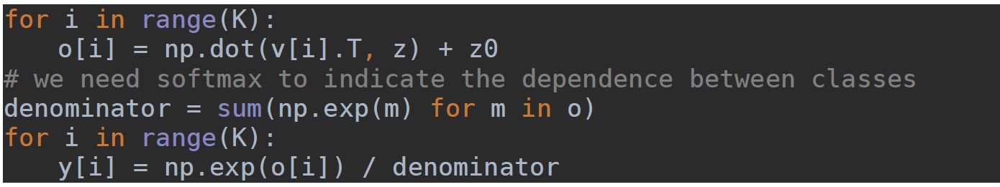
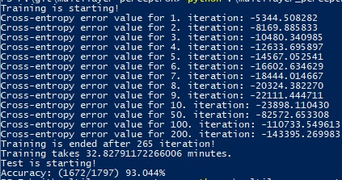
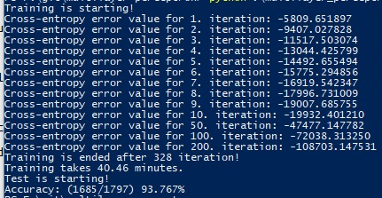

# Multilayer Perceptron

In this project, I tried to devise a model of multilayer perceptron. Perceptron are one of the oldest artificial neural networks, although they are extremely limited. Perceptron are based on the principle that a neuron cell produces an output by taking more whole inputs. If these neurons aren’t directly give the output, it means that it is a multilayer perceptron and another function is necessary to compute outputs. Thus, these neurons at the middle create a hidden unit that called hidden layer. Output of the first neurons are the inputs of the next layer, which gives the output in this task. As a result, we needed to create a two-layer perceptron. I used Ethem Alpaydin’s pseudo-code for implementation, but I made a few changes. For instance, since there are 10 classes, 10 outputs which are more than 2 (i. e. K>2), I changed the output function. I made a softmax function instead of sigmoid:

After I implemented the code, I tried lots of times to find the best learning rate for convergence. I tried 0.1 , 0.15 and 0.2 values, and I chose 0.15 as learning rate. Then, I decided the threshold value for convergence. After 200 iterations, I started to calculate the sum of gradient descent matrices values, and if it’s less than 0.00003 , I assumed it’s converged and finished the training. The result of the training data, and testing the weight vectors with test data are as follows:

As it has seen obviously, cross entropy error value decreases when iteration number incereases, and so the change of weight vectors descreases, i. e. gradient descent of weight vectors. When the change is too small, less than the threshold, training finishes and testing starts. Another observation might be that when iteration number increases, accuracy increases, too.

**Note:** Training takes lots of time, but when I trained with 80-100 iterations, which takes 8- 11 minutes, accuracy was approximately %90-91.